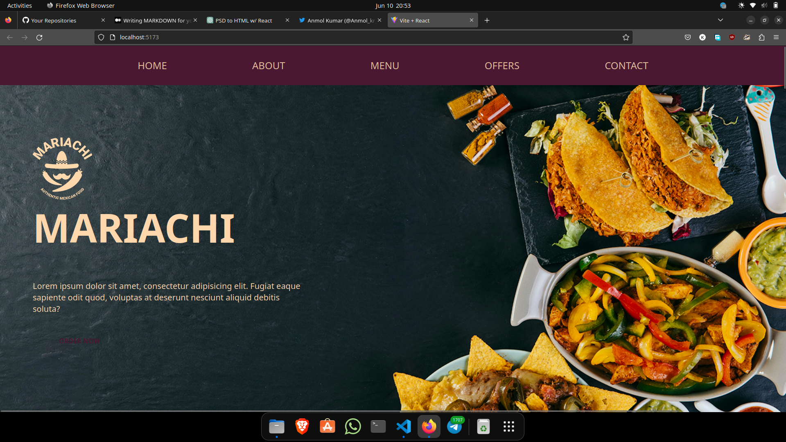
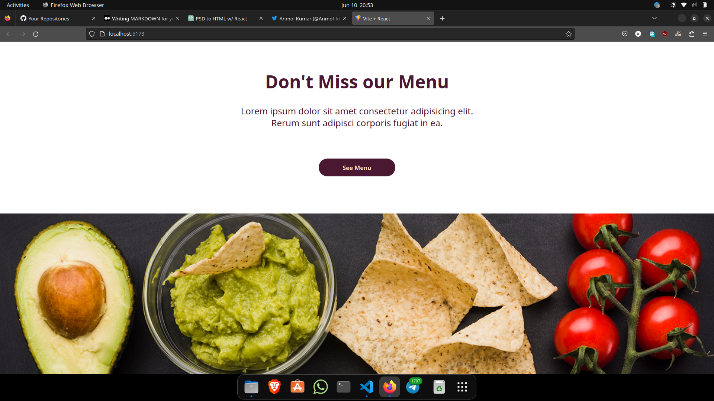
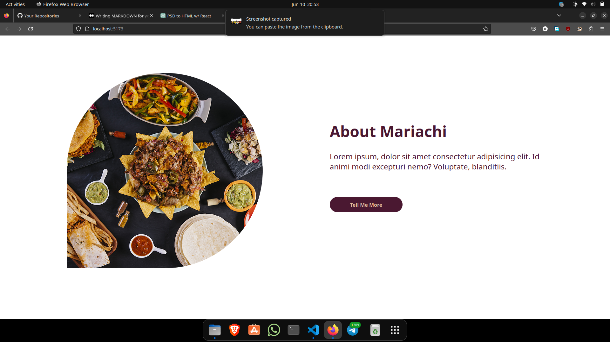
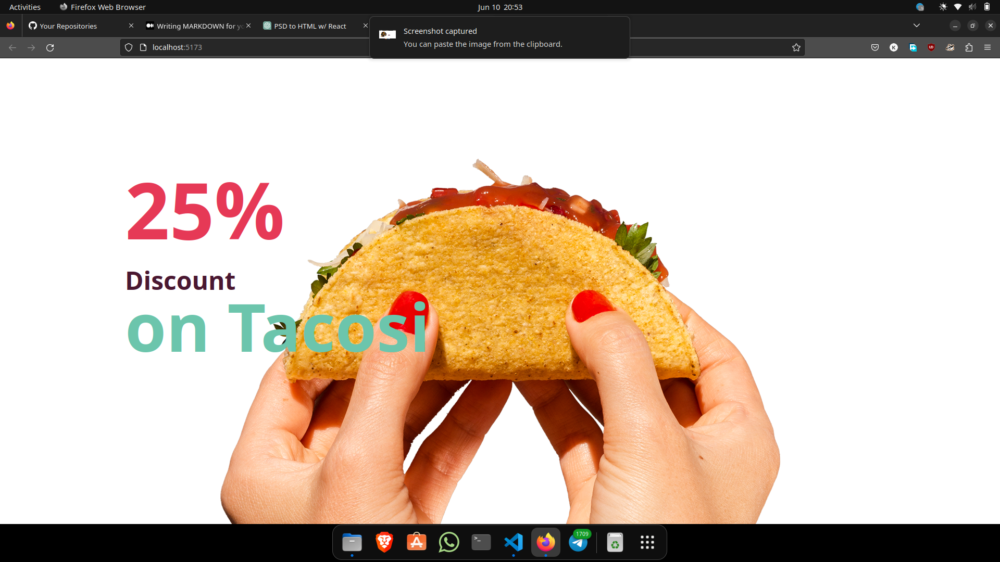
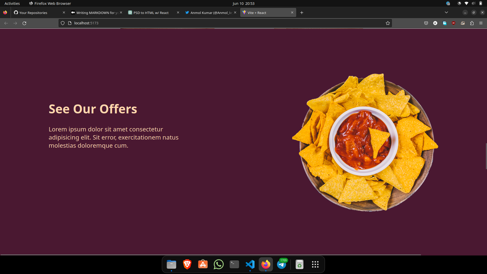
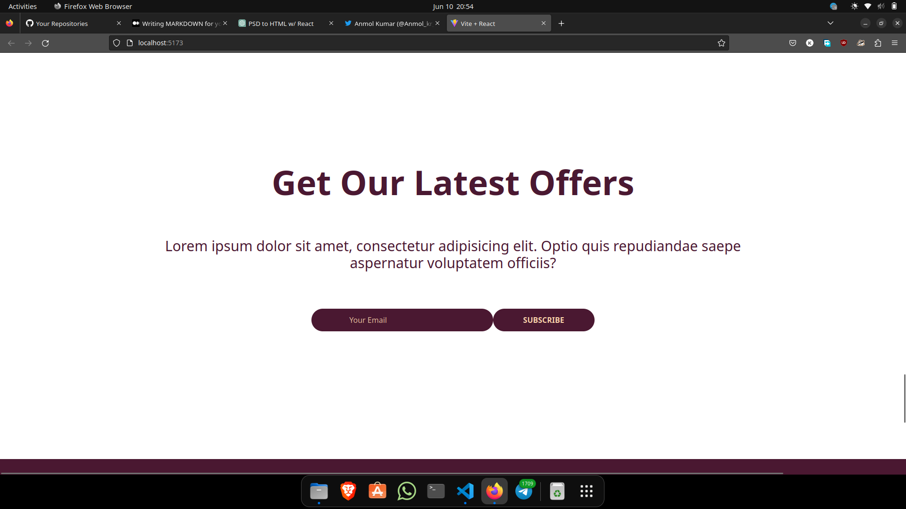
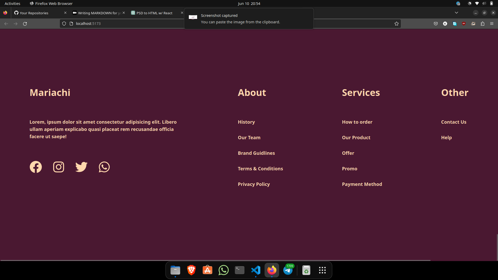

# The Mariachi - Restaurant Landing Page

Welcome to The Mariachi project, a restaurant landing page showcasing the delicious food and vibrant atmosphere of our restaurant. This project aims to provide an attractive and engaging online presence for our restaurant.

## Project Overview

The Mariachi restaurant landing page project includes the following key features:

- **Homepage**: An appealing landing page that introduces the restaurant and highlights its unique features.
- **Menu**: A dedicated section to showcase our mouth-watering menu items with attractive images and descriptions.
- **About Us**: A page that provides information about our restaurant's history, mission, and vision.
- **Reservation**: A reservation form allowing customers to book a table and specify their preferred date and time.
- **Contact Us**: A contact form and contact details to allow visitors to get in touch with us.

## Technologies Used

The following technologies were used in this project:

- HTML: Markup language used for structuring the web page content.
- CSS: Styling language used for designing the website's appearance.
- JavaScript: Programming language used for interactivity and functionality.
- TailwindCSS: A utility first CSS framework.
- ReactJS: JavaScript library for frontend developement.

## Getting Started

To get started with this project, follow these steps:

1. Clone the repository: `git clone https://github.com/Anmol8611/themariachilandingpage.git`
2. Navigate to the project directory: `cd themariachilandingpage`
3. install the required packages: `npm install`
4. run the program: `npm run dev`

## Folder Structure

The project's folder structure is organized as follows:

the-mariachi/
|- public/assets/ # Images and icons
|- index.html # Homepage HTML file
|- src #contains all the components and code
|- README.md # Project documentation

## Screenshots

## Contact

If you have any questions or need further assistance, please contact [Anmol_kr_twt](https://twitter.com/Anmol_kr_twt).

We hope you enjoy exploring The Mariachi restaurant landing page!
